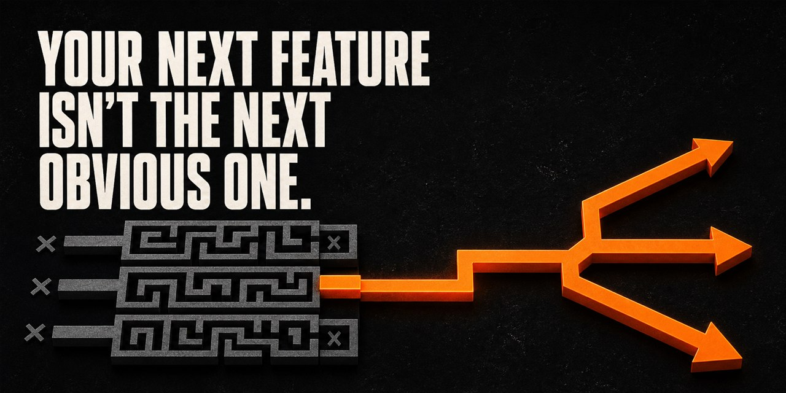

# lateral-thinking

**Your product isn't out of ideas. It's stuck in the obvious ones.**

[](LICENSE)


Give your AI coding agent eight structured ways to find a better product direction — not just another feature to ship. A router diagnoses how you're stuck and picks the right move.



---

## The demo

Same agent. Same prompt. One of them read a skill first.

> **Prompt:** *"Our users create one project, then never return. What product direction would make that first project worth coming back to?"*

<table>
<tr>
<th width="50%">Any agent, vanilla</th>
<th width="50%">Same agent, <code>random-stimulus</code></th>
</tr>
<tr valign="top">
<td>

**Onboarding checklist**
Give them three next steps after project creation.

**Weekly email summary**
Remind them what changed and invite them back.

**Personalized dashboard**
Make the home screen more useful after the first project.

*(Three sensible features. One idea: ask the user to remember the product.)*

</td>
<td>

🗼 **The lighthouse beam**
It does not light the whole sea. It sends a precise signal when navigation matters.

→ A return trigger should be caused by the user's project, not by a generic reminder.

**Beacon** — when a project reaches a date, risk, or decision the user chose at creation, send one concise signal explaining why it needs attention now.

🍞 **The sourdough starter**
It becomes more useful between visits. Small inputs create a living thing worth checking on.

→ A first project should begin a rhythm, not become a static container.

**Pulse** — turn the first project into a lightweight weekly brief: what changed, what is blocked, and the one decision that would move it forward.

🎡 **The Ferris wheel** — it repeats a visible loop, but the force-fit only produced a prettier recurring dashboard. **Abandoned.**

</td>
</tr>
</table>

The vanilla answer isn't bad. It's *good* — and every feature asks the user to do more work or remember to return. Three features, one idea.

The technique produced different **product directions**: a project that signals at the right moment, and a project that gets more useful between visits. The meta-pattern is the point: retention is not a reminder problem. It is a **new-signal problem**. Give people a reason to return that did not exist when they left.

---

## Install

**Any agent (recommended):**

```bash
npx skills add danium/lateral-thinking
```

**Claude Code (plugin):**

```
/plugin marketplace add danium/lateral-thinking
/plugin install lateral-thinking@lateral-thinking
```

**Codex:** ask `$skill-installer` to install from `https://github.com/danium/lateral-thinking`

**Manual:** clone and copy `skills/*` into your agent's skills directory.

> The toolkit installs as one bundle — the `lateral` router needs its sibling techniques.

---

## Pick your technique

| Symptom | Technique |
|---|---|
| Ideas all feel the same; brainstorm output is predictable | [`random-stimulus`](skills/random-stimulus/SKILL.md) |
| A constraint or rule feels unbreakable | [`provocation`](skills/provocation/SKILL.md) |
| Requirements assume things nobody has questioned | [`inversion`](skills/inversion/SKILL.md) |
| We might be solving the wrong problem | [`concept-fan`](skills/concept-fan/SKILL.md) |
| The solution works but feels derivative | [`analogy`](skills/analogy/SKILL.md) |
| We have one idea and need variations | [`scamper`](skills/scamper/SKILL.md) |
| A decision is being made too fast / everyone agrees | [`six-hats`](skills/six-hats/SKILL.md) |
| Everything feels timid, safe, cautious | [`worst-idea`](skills/worst-idea/SKILL.md) |

**Applied:** [`post`](skills/post/SKILL.md) — a post on a topic or a reply to someone's post, routed through the toolkit and shaped into drafts you can send.

Or just tell your agent **"use the lateral skill"** and let it diagnose you.

---

## Anatomy of a session

Every technique in this repo makes failures visible. Here is `scamper` refusing to pad its own output, mid-session:

> **Substitute:** nothing new. The command is already swapped down to one line, and the only meaningful substitution (git for installer) already ships as a channel. Moving on.
>
> **Put to other use:** empty. The install does one job and generates no by-product worth repointing. Moving on.
>
> **Reverse / Rearrange:** empty as a distinct idea. The one real reversal (router-first, siblings later) is Variant D under another name, so it counts once. Nothing else to flip. Moving on.

Three of seven operations came up empty — and the last one had a genuine hit that it *disqualified for being a duplicate.*

This is the whole point. An agent that produces seven strong ideas from seven prompts is pattern-matching on the shape of a good answer, and you can't tell which ideas it actually believes. Every skill here carries an **abandonment rule** — a stated condition for giving up, and an instruction to show you when it does. The visible failures are what make the rest credible.

The second requirement is a **meta-pattern step**: after the batch, scan across what landed and name the structural insight. In that `scamper` session, the empty operations *were* the finding — the install command's surface is already tight, so the softness had to be somewhere else. It was: in the unstated dependency between the router and its siblings.

---

## What this is (and isn't)

These are real methods, sourced:

- **Random Stimulus**, **Provocation (Po)**, **Concept Fan** — Edward de Bono, *Lateral Thinking* (1970), *Po: Beyond Yes and No* (1972), *Serious Creativity* (1992)
- **Six Thinking Hats®** — Edward de Bono (1985). A registered trademark of the de Bono Group; this is an independent educational implementation.
- **SCAMPER** — Bob Eberle (1971), building on Alex Osborn's checklist
- **Forced Analogy** — Synectics, William J.J. Gordon (1961)
- **Assumption Inversion** — classical dialectic; "invert, always invert" (Carl Jacobi, via Charlie Munger)
- **Worst Possible Idea** — reverse brainstorming; standard in the d.school/IDEO toolkit

**This is not magic and it is not a prompt pack.** It is structured divergence with quality rules attached. The techniques constrain *how* an agent generates, and the honesty mechanics constrain what it's allowed to claim afterward.

**On invocation:** auto-invocation is best-effort — your agent may or may not reach for a skill on its own, and that depends on the agent. For the reliable path, name the skill or ask your agent to use the router.

---

## Contributing

New techniques need provenance and honesty mechanics. Worked examples must come from real sessions. See [CONTRIBUTING.md](CONTRIBUTING.md).

## License

[MIT](LICENSE)
